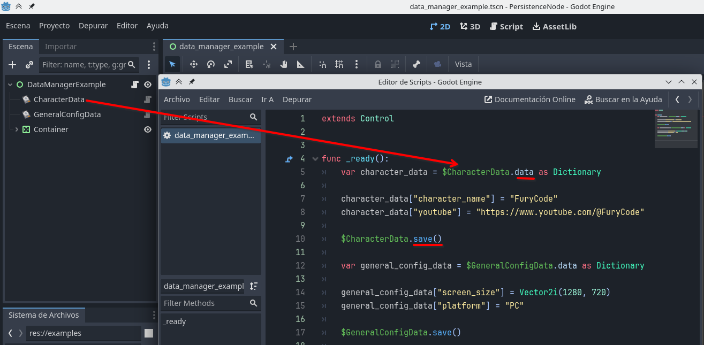
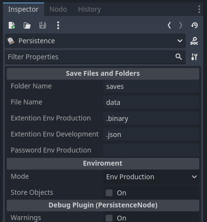

# PersistenceNode

Addon to store data in text or encrypted files, in Godot Engine 4, in an easy way.

# Branchs

- main: Default development branch for Godot 4
- for-godot-3.0: Branch for Godot 3.x
- for-godot-2.1: Branch for Godot 2.x

# Installation

Soon

# Explanation

The **persistence node** consists of obtaining the `data` and storing it in persistent memory when needed.

To obtain the `data` we use our custom node *Persistence*. `data` is a property of *persistence* node you can get that data and write de dictionary but **Don't override the dictionary**

- **BAD**:

`$MyPersistenceNode.data = { "new dictionary" : "something" }`

- **GOD**:

`$MyPersistenceNode.data["something"] = "data here"`

The line marked **Bad** is different because it is trying to overwrite the value of the data dictionary to be stored in persistent memory.

On the other hand, the **God** line is different because it is adding or changing the information of "something".

Let's see the properties of the "persistence" node in the inspector.

## Properties and Functions

| Properties | Usage                                                                                    |
|------------|------------------------------------------------------------------------------------------|
| `data`     | (Only Read) You can access the data and then save it in this way $MyPersistenceNode.data |

| Functions       | Usage                                                                                                                   |
|-----------------|-------------------------------------------------------------------------------------------------------------------------|
| `save()`        | Stores data in persistent memory, stores the data in persistent memory, in a json file, or in an encrypted binary file. |
| `delete_file()` | Delete current file.                                                                                                    |

## Inspector

- **Folder Name**: Is the name of the *folder* in which we want to store the information.
- **File Name**: It is the name of the *file* in which we want to save the information. *If you want to save information in more than one file, it is recommended to create more than one persistence node and change the file name (this property)*.
- **Extention Env Production**: (Extension for the production environment) normally we want it to be a *binary in production mode* (when we launch the game). The extension can be changed but the file will be binary and encrypted with a password, the password must be placed in *Password Env Production*.
- **Extention Env Development**: Normally we want it to be a *JSON* for the production environment as we can read the data easier and debug.
- **Password Env Production**: This is the password that is necessary to encrypt the data so that it cannot be read by anyone, it is important to fill in this information. Before releasing the game to production.
- **Mode**: Current node mode, normally the development environment is used when coding and should be switched to production when the game is released.
- **Store Objects**: Ability to store objects activated, yes or no.
- **Warnings**: Is used to display warnings during the development of this plugin, it can also be useful in case of an unexpected error.

## Recomendations

- Use the `save()` function only when necessary, since it accesses persistent memory and this is slower than accessing volatile memory such as RAM.
  - **Bad**: Use `save()` every time a bullet is fired in the game, to store at each moment the information of the number of bullets the player has.
  - **Good**: Use `save()` when exiting the game or the main game screen.
- Use a persistence node for each file that is created.

# Tutorial (In Spanish)

Soon
